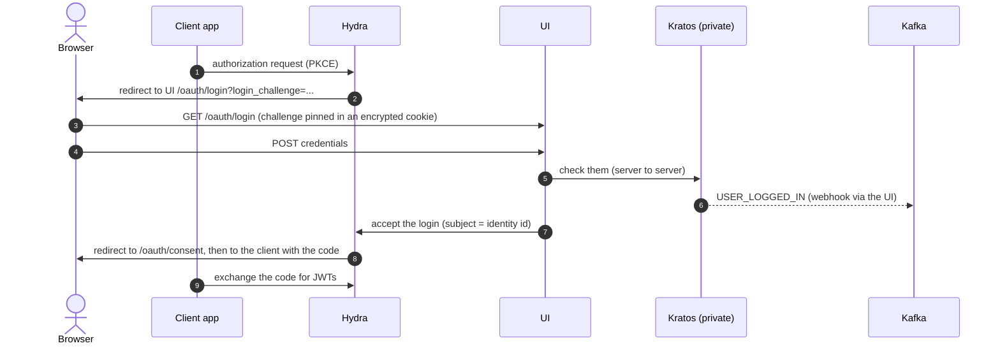

# IdP

The identity provider for the Bus 2.0 platform: the login, registration and account-recovery experience, and the OAuth2 / OIDC tokens behind it.

It is made of three parts that only make sense together:

- **[Ory Hydra](https://www.ory.sh/hydra/)** issues the tokens (OAuth2 / OIDC, JWT access tokens).
- **[Ory Kratos](https://www.ory.sh/kratos/)** stores identities and checks credentials. It is private: nothing but the UI can reach it.
- **The UI (`ui/`, Next.js)** is Hydra's login, consent and logout handler and the only client of Kratos. It also publishes every user event to Kafka.

Apps never talk to Kratos. They start a normal OAuth2 flow against Hydra; Hydra sends the browser to the UI; the UI authenticates the user against Kratos and tells Hydra the result.

## How a sign-in works



- **Register** is the same flow with `screen_hint=signup`. The phone must be verified with an OTP before any token is issued.
- **Forgot password** sends a code by email, then lets the user set a new one.
- **Email verification** is a signed link (not an OTP) that works from any device. After it, "Return to app" goes to the client's registered redirect URI.

## Events

Everything the IdP announces goes to **one Kafka topic, `idp.events`**, keyed by identity id, as `{id, event, occurred_at, source, data}`. A notification service (not in this repo) consumes it and sends the emails and SMS.

| Event | Carries |
|---|---|
| `USER_REGISTERED` | identity id, email, phone, name, gender |
| `USER_LOGGED_IN` | identity id, phone, email |
| `USER_MOBILE_VERIFICATION_REQUEST` | identity id, phone, **OTP** (`code`) |
| `USER_MOBILE_VERIFICATION_SUCCESS` | identity id, phone |
| `USER_FORGOT_PASSWORD` | identity id, email, **recovery code** (`code`) |
| `USER_RESET_PASSWORD` | identity id, email, phone |
| `USER_EMAIL_VERIFICATION_REQUEST` | identity id, email, **`verification_url`** |
| `USER_EMAIL_VERIFICATION_SUCCESS` | identity id, email |

Delivery is at-least-once for the events that carry a code (Kratos retries), and best effort for the rest. Consumers should de-duplicate on `id`.

## Quick start (local)

Needs Docker with Compose, and `make`. Every service runs on the external `shohoz` network, shared by the repos in this workspace (`make network` creates it).

```sh
make network                 # once: creates the shared docker network
docker compose up -d --build # Postgres, Hydra, Kratos, Kafka (Redpanda), the UI
```

To try a real login, run the throwaway OIDC client in `../TestClient` (a separate repo) and open <http://localhost:3002>.

| Service | URL |
|---|---|
| UI | <http://localhost:3001> (only reachable through an OAuth flow) |
| Hydra public | <http://localhost:4444> |
| Hydra admin | <http://localhost:4445> (loopback only) |
| Kafka (host tools) | `localhost:19092` |

Kratos is deliberately **not** published. Local shortcuts: the phone OTP is always `123456`, and email links are printed in `docker compose logs idp-ui`.

## Configuration

Ory config is written **once**, in `chart/config/`, and used as is by both docker-compose (bind mount) and the Helm chart (ConfigMap). Nothing is rendered or templated: the files hold only values that are the same everywhere. What differs per environment is set outside them: Hydra's issuer and login / consent / logout URLs through Hydra's env vars in `docker-compose.yaml` and through `helmvars/` in the chart. See `AGENTS.md` before editing.

| Path | Contents |
|---|---|
| `chart/config/kratos/` | Kratos: `kratos.yaml`, `selfservice.yaml` (flows and hooks), `courier.yaml`, the identity schema, and one `*.jsonnet` body template per event |
| `chart/config/hydra/hydra.yaml` | Hydra: token lifetimes and the JWT claims it keeps (URLs come from the environment) |

The UI is configured by environment variables:

| Variable | Meaning |
|---|---|
| `PUBLIC_UI_URL` | The UI's public URL |
| `KRATOS_INTERNAL_URL`, `KRATOS_ADMIN_URL` | Kratos public and admin (cluster-internal) |
| `HYDRA_ADMIN_URL`, `HYDRA_JWKS_URL`, `JWT_ISSUER`, `API_AUDIENCE` | Hydra integration; bearer tokens are verified as JWTs |
| `CORS_ALLOWED_ORIGINS` | Client web origins allowed to call the UI's bearer-token API |
| `UI_FALLBACK_URL` | Optional (http/https). Where an auth page opened without a sign-in in progress redirects to (e.g. the company site). Unset: a 403 "can't be opened directly" page |
| `KAFKA_BROKERS`, `KAFKA_TOPIC_EVENTS` | Where events are published (`idp.events`) |
| `UI_COOKIE_SECRET`, `EMAIL_TOKEN_SECRET` | Secrets (see Deploying) |
| `DEV_STATIC_OTP`, `DEV_LOG_EMAIL_LINKS` | **Local only.** Never set in a real environment |

## Repository layout

| Path | Contents |
|---|---|
| `ui/` | The Next.js app: login, registration, OTP, recovery, Hydra handlers, event publishing |
| `chart/` | Helm chart: Hydra and Kratos (official Ory subcharts), the UI, Postgres, network policy |
| `chart/config/` | Ory config shared with docker-compose (above) |
| `helmvars/` | Per-environment Helm values (`domain`, UI image, Kafka brokers) |
| `docker-compose.yaml` | The local stack |
| `scripts/` | `add-client.sh`, used by `make add-client` |
| `devspace.yaml` | Local Kubernetes dev workflow |

Related repos in this workspace: `../Auth` (RBAC), `../Traefik` (gateway), `../TestClient` (throwaway OIDC client for testing).

## Deploying

```sh
helm dependency build chart
make lint template          # helm lint / template for every helmvars file
helm upgrade --install idp chart -f helmvars/dev.yaml
```

The chart references **pre-created Secrets** and never creates them:

| Secret | Keys |
|---|---|
| `idp-postgres` | `password`, `dsn` |
| `idp-hydra` | `secretsSystem`, `secretsCookie` |
| `idp-kratos` | `dsn`, `secretsDefault`, `secretsCookie`, `secretsCipher` (exactly 32 bytes) |
| `idp-ui` | `cookieSecret`, `emailTokenSecret` |

Per environment, `helmvars/` sets the domain, Hydra's URLs, the UI image and `kafka.brokers` (Kafka is not part of the chart). Register OAuth2 clients with `make add-client`.

See `AGENTS.md` for the rules that must not be broken, and `CONTRIBUTING.md` before opening a change.
